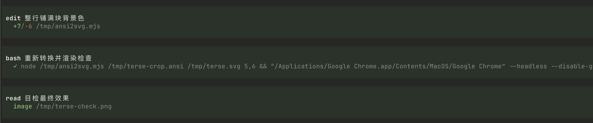
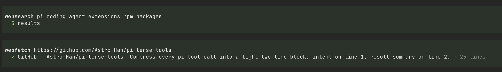

# pi-terse-tools

A monorepo of lean, focused extensions for the [Pi coding agent](https://github.com/earendil-works/pi-coding-agent). Each package under `packages/` is independently installable and publishable. The rendering stays close to pi's native TUI — same colors, backgrounds, and success/error states — just compressed to what matters.



## Packages

| Package | npm name | What it does |
|---|---|---|
| [`packages/terse`](packages/terse) | `pi-terse-tools` | Compress every pi tool call into a tight two-line block: intent on line 1, result summary on line 2. |
| [`packages/web`](packages/web) | `pi-terse-web` | Lean web fetch + web search: URL → clean markdown, query → results. One fetch, one timeout, no SSRF DNS gymnastics. |

## Install

Each package is published to npm and installed through pi's package manager:

```bash
pi install npm:pi-terse-tools   # compact two-line tool blocks
pi install npm:pi-terse-web     # lean webfetch + websearch
```

Or load one for a single run without installing:

```bash
pi -e npm:pi-terse-tools
```

## Usage

**pi-terse-tools** — no configuration. Once loaded, every call to the built-in tools renders as a two-line block: the model's one-sentence intent on line 1, a colored result summary (✓ / ✗ / diff counts / line counts) on line 2. Press `C-o` on a block to expand the full output. See [`packages/terse/README.md`](packages/terse/README.md).

**pi-terse-web** — `webfetch` works out of the box. `websearch` needs an Exa API key:

```bash
export EXA_API_KEY=...
```



See [`packages/web/README.md`](packages/web/README.md) for the design rationale and coexistence with `pi-web-access`.

## Layout

- `packages/*` — publishable pi packages, each with its own `package.json`, `src/`, and `test/`.
- `docs/` — shared decision records (e.g. abandoned explorations and why).

## Develop

```bash
npm install
npm test
```

Node >= 22.19.0. Test files are plain `.ts` run directly via `node --test` (no build step).

## License

MIT.
